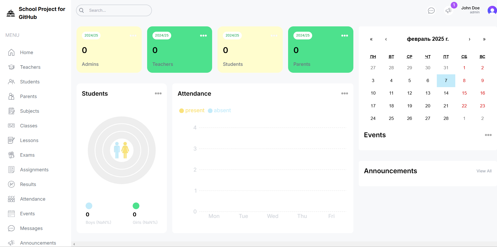
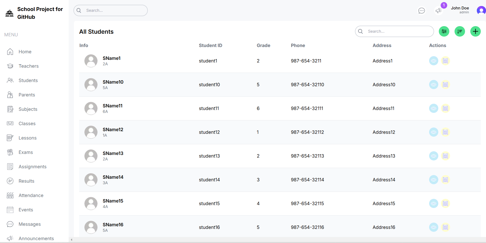

# School Management Dashboard

This project uses:
Next
Postgresql
Clerk
Cloudinary
Tailwindcss
## Before start
In the .env file you must specify your variables to run the project.

NEXT_PUBLIC_API_URL=you_host
DATABASE_URL=postgresql://[your_user]:[your_password]@[hosr]:5432/[name_db]
NEXT_PUBLIC_CLERK_PUBLISHABLE_KEY=your_publickClerk_key
CLERK_SECRET_KEY=you_secret_key
NEXT_PUBLIC_CLOUDINARY_CLOUD_NAME=your_cloudinary

## Getting Started

You can run this project using Docker. Just go to the project folder and run the command

docker-compose up -d

After installation, you need to fill the database with data. Run the command

npx prisma db seed

Open [http://localhost:3000](http://localhost:3000) with your browser to see the result.

## Note
To run this project you must register accounts in these services and get secret keys.

Clerk
Cloudinary

